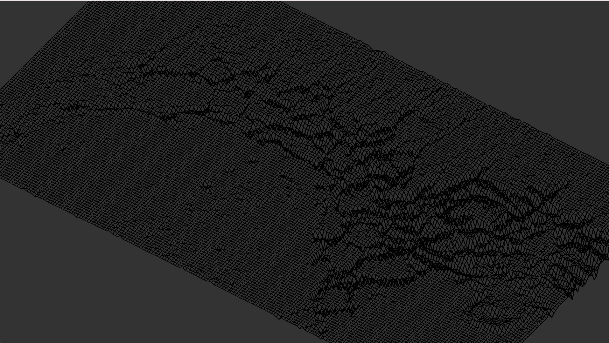

# FDF: Drawing wirerframe heightmaps.

## Mars fdf:

## Words:
FDF is an interesting project the acts as almost an introduction to 3D, but not quite.
By parsing the map files and translating the values into vec3 coordinates we can then apply a series of translations to rotate and move the 3d object, and finally project the points into 2D space, these points are then used to draw squares to create the wireframe.

My ability to overcomplicate this simplicity has caused me to design a whole pipeline around translating the points but that's just me.

## Usage

`./fdf.out {path to map file}`

## Controls:

ESC to exit the application. 
R to reset/redraw the projection.

# To Do:
- Scroll to zoom
- Keyboard translation
- Add another type of projection
- Rotation
- Cleanup
